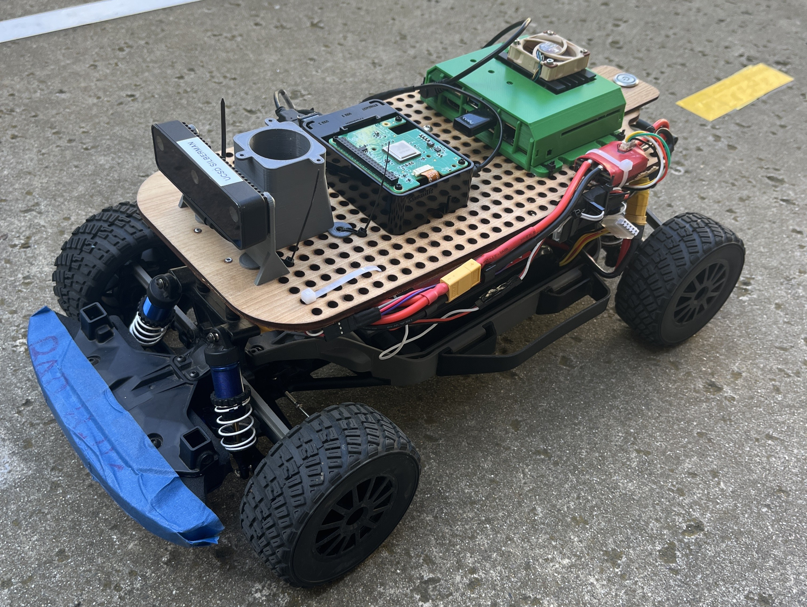
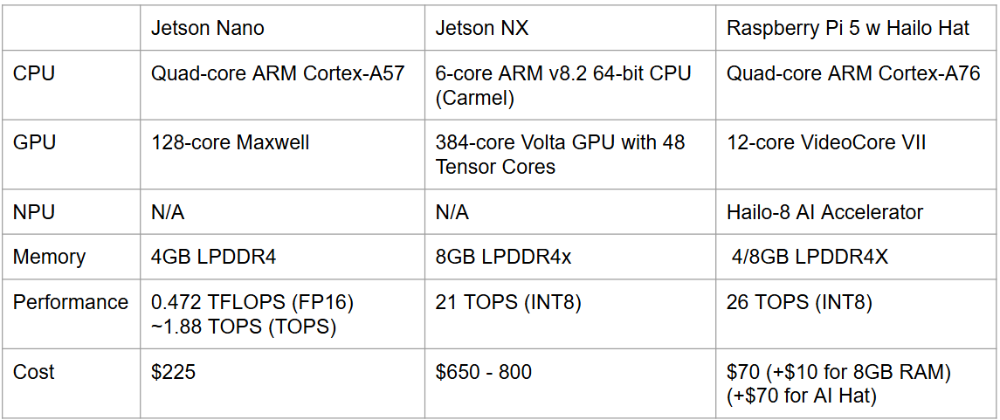
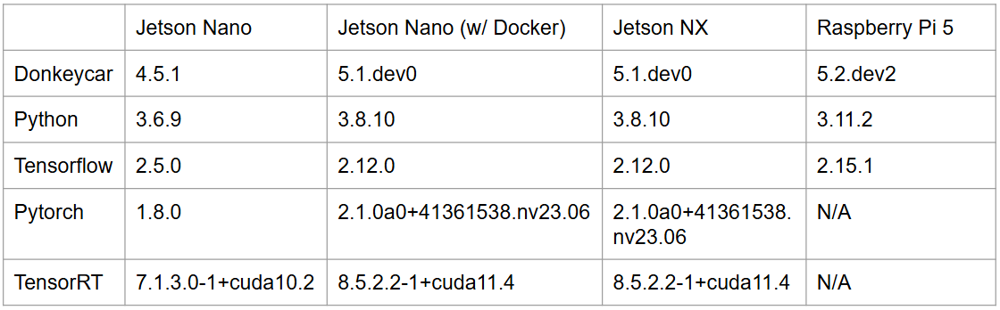
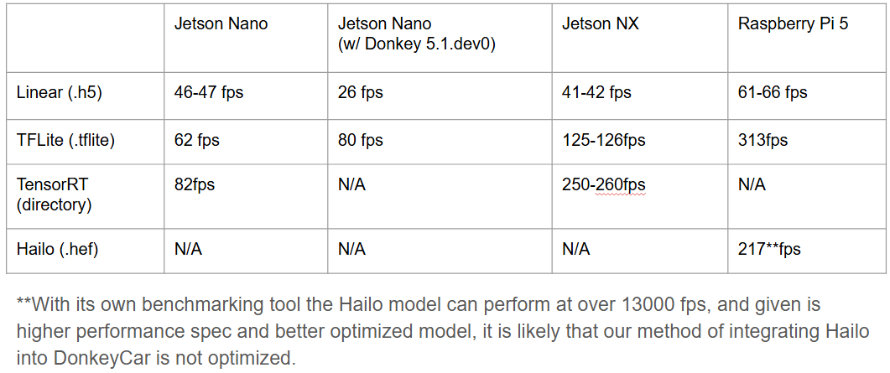

# 
Jetson Nano/NX vs. Raspberry Pi 5 Performance

### 
ECE MAE 148 Final Project

#### 
 Team 4 Winter 2025 

  

## Table of Contents
  <ol>
    <li><a href="#team-members">Team Members</a></li>
    <li><a href="#abstract">Abstract</a></li>
    <li><a href="#what-we-promised">Promises and Stretch Goals</a></li>
    <li><a href="#hardware">Hardware</a></li>
    <li><a href="#software">Software</a></li>
    <li><a href="#final-metrics">Final Metrics</a></li>
    <li><a href="#accomplishments">Accomplishments</a></li>
    <li><a href="#challenges">Challenges</a></li>
    <li><a href="#documentation">Documentation</a></li>
    <li><a href="#Potential-Improvements">Potential Improvements</a></li>
    <li><a href="#Course-Deliverables">Course Deliverables</a></li>
  </ol>

## Team Members
Jake Honma - MAE Controls & Robotics - Class of 2026 - jhonma@ucsd.edu

Harsh Salva - MAE Controls & Robotics - Class of 2026 - hsavla@ucsd.edu

Andrew Dunker - ECE ML & Controls - Class of 2025 - adunker@ucsd.edu

Jingli Zhou - Math/CS- Class of 2027 - jiz228@ucsd.edu

## Abstract
Our project aimed to measure the performance of deep-learning models trained on DonkeyCar on the Jetson Nano, Jetson Xavier NX, and the Raspberry Pi 5 (w/ & w/o Hailo AIHAT+).

## Promises and Stretch Goals
Promised
*Benchmarked performance for:
  * Jetson Nano w Tensorflow/TensorRT
  * Jetson NX w Tensorflow/TensorRT
  * RPI w Tensorflow/HailoRT
*Documentation for the Process

Stretch Goals
* Benchmarked performance for models with different resolutions
* Fully integrate the Hailo Model with DonkeyCar

## Hardware

  

## Software

  

## Final Metrics

  

## Accomplishments
- Document the process for setting up DonkeyCar on the RPI 5.
- Document the process for converting linear (.h5) models into TensorRT directories and Hailo Executable Files (.hef through AIHAT+).
- Benchmarked performance for 160x120 resolution model across all hardware.
- Load and integrate Hailo Executable Files into DonkeyCar.

## Challenges
- Going into the project our Jetson SD card was corrupted. Initially, we used a backup image, but this was using a lower version JetPack that did not allow us to test models. We then had to completely reflash our SD card, reinstall all the dependencies, and setup up DonkeyCar again.
- There is out-of-date documentation for converting linear models to utilize TensorRT GPU acceleration. This needed to be updated and varied based on different dependencies across the Jetson Nano & Jetson NX.
- Without GPU access in a previously set-up docker container, TensorRT conversion could not be completed. 
- Due to the recency of which Hailo Executable Files were introduced and the limited documentation, attempting to integrate .hef files into DonkeyCar was difficult.
- We could not physically test the performance of models through manage.py drive due to VESC issues at low speeds.

## 

## Documentation
- [TensorRT Directory Conversion](https://docs.google.com/document/d/1uFYIIE-uktmeWYbOzpLOD6yCFHX5uv2XQ3kKLQtFRs0/edit?usp=sharing)
  - JetsonNX/Jetson Nano TensorRT Donkey Setup, Benchmarking with RT, Drive - Model
- [RPI Setup & AIHAT+ Benchmarking](https://docs.google.com/document/d/1QD8mm4k70a3tMuctATGWsUEb5U5Y7lgBpjXv3FvxDJg/edit?usp=sharing)
  -Raspberry Pi Donkey Setup, Benchmarking with Tensor Flow and TFlite
    -Setting up Hailo on Raspberry Pi

## Potential Improvements
- Optimize the integration of Hailo in DonkeyCar
  - Though we were able to get a .hef file to run in DonkeyCar, based on the results and what we expected, the integration could be performed more efficiently.
- Test Models at Different Resolutions
  - Test and optimize models based on OAKD lite resolution and hardware (Jetson vs. Raspberry Pi 5) to find the highest-performing resolutions for deep learning.
- Continue to Optimize DonkeyCar Training
  - Finish optimizing memory management to allow training of larger resolution models

## Course Deliverables
- [Autonomous Laps](https://www.youtube.com/watch?v=mdhzcTpqjOU)
- [GPS Laps](https://www.youtube.com/watch?v=Q9K-zgcOB_M)
- [OpenCV Laps](https://www.youtube.com/watch?si=N4yd2DVbfe8NtFZ2&v=eWItPylQU4o&feature=youtu.be)
- [Final Presentation Slides](https://docs.google.com/presentation/d/1YaHtMM433_lcRRZqx4on65JFk8WVf2HLRQRkMYOuo30/edit?usp=sharing)

